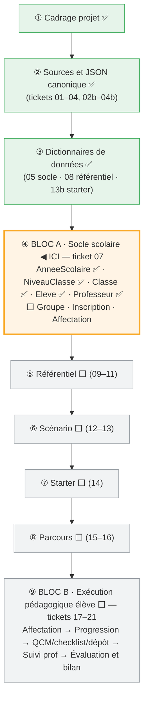

# Journal de progression — RéférenCiel Manager

> **Objet.** Ce document raconte, chapitre par chapitre, **ce qui a été fait**
> concrètement pour construire l'application : commandes lancées, entités créées,
> SQL généré, décisions prises (et pourquoi), blocages rencontrés. Il sert de
> **matière première** pour la future documentation du projet.
>
> **Comment le tenir.** À chaque nouvelle étape, on ajoute une sous-section datée
> avec : *contexte → commandes → résultat → décisions*. On relie aux ADR
> (`docs/adr/`) et aux retours banc d'essai (`docs/banc-essai/`) plutôt que de tout
> recopier.

---

## 1. Fondations documentaires

Avant tout code métier, le projet a posé sa **chaîne documentaire** :

- **Cadrage** : `docs/cadrage/instructions.md` (prioritaire), `cadre-projet-referenciel-manager.md`.
- **Décisions (ADR)** : `docs/adr/` — voir le [journal ADR](adr/index.md).
- **JSON canonique** : contrats + schémas + exemples (`docs/specs/json-canonique/`),
  pour deux types : `referentiel_niveau_classe` et `starter_welcome`.
- **Dictionnaires de données** : `docs/specs/data-dictionary/` (référentiel, socle
  scolaire, starter welcome).
- **Outillage qualité** : `make check` = 5 portes (pyright strict, ruff, pytest,
  `mkdocs --strict`, `forge project:check`).

La formule de référence du projet :

```text
JSON canonique          = référence structurée de construction / import
Dictionnaire de données = documentation métier enrichie
Base de données         = vérité applicative en fonctionnement
```

---

## 2. Choix du backend : MariaDB (ADR-004)

Parmi les backends Forge (hors SQLite : MariaDB, PostgreSQL alpha, MSSQL alpha),
**MariaDB** a été retenu — seul opt-in **complet**, cohérent avec la règle « 100%
Forge », et largement suffisant pour la charge d'une application pédagogique.

- Décision : [ADR-004](adr/004-backend-base-de-donnees-mariadb.md).
- Le porteur installe l'opt-in `forge-mvc-mariadb` lui-même.

---

## 3. Montée de squelette Forge « en place » (ADR-009)

Le projet suit l'évolution du framework. Une première tentative de migration **par
déplacement de dossiers** a cassé le `.venv` (chemins absolus, non déplaçable) →
**rollback complet**. On a alors défini une méthode **en place** :

- **Décision** : [ADR-009](adr/009-montee-squelette-forge-en-place.md) + procédure
  [Montée de squelette Forge](procedures/montee-squelette-forge.md) (manifeste de
  propriété : fichiers *squelette* vs *projet*).
- **Outillage** créé :
  ```bash
  make skeleton-check REF=../Test    # écarts entre le projet et un forge new neuf
  make forge-upgrade COMMIT=<sha>    # bump du pin + réinstall forcée + make check
  ```
- **Piège documenté** : un pin git à version identique (`1.0.0rc2`) n'est **pas**
  re-fetché par pip → `pip install --force-reinstall --no-deps` (géré par la cible).
- **Structure des routes** (nouveauté ADR-068 côté Forge) : `mvc/routes/` est un
  **package** ; un fichier `mvc/routes/<x>_routes.py` par contrôleur exposant
  `register_<x>_routes(router)`, branché dans `mvc/routes/__init__.py`.

Commits de montée : passage du pin `forge-mvc` `e3197866` → **`f38d5159`** (version
intégrant les correctifs des retours).

---

## 4. Mise en place de MariaDB

### 4.1 Provisioning

`forge db:init` **affiche** le SQL de provisioning (mode par défaut) ; on l'exécute
en session admin (`sudo mariadb`) :

```sql
CREATE DATABASE IF NOT EXISTS `ReferenCiel_Manager`
  CHARACTER SET utf8mb4 COLLATE utf8mb4_unicode_ci;
-- compte admin (DDL) et compte applicatif (DML), scellés à la base
CREATE OR REPLACE USER 'app_admin'@'127.0.0.1' IDENTIFIED BY 'app_password';
GRANT ALL PRIVILEGES ON `ReferenCiel_Manager`.* TO 'app_admin'@'127.0.0.1';
CREATE OR REPLACE USER 'app_user'@'127.0.0.1' IDENTIFIED BY 'app_password';
GRANT SELECT, INSERT, UPDATE, DELETE ON `ReferenCiel_Manager`.* TO 'app_user'@'127.0.0.1';
FLUSH PRIVILEGES;
```

Config de connexion dans `env/dev` (gitignoré) : `DB_HOST=127.0.0.1`, `DB_PORT=3306`,
`DB_NAME=ReferenCiel_Manager`, `DB_ADMIN_*`, `DB_APP_*`.

Le backend est déclaré dans `optins/registry.py` : `BACKEND = "mariadb"`.

### 4.2 Table `forge_migrations`

Le registre des migrations n'était pas créé par le provisioning manuel
(→ [retour-003](banc-essai/retour-003-forge-migrations-provisioning-manuel.md),
**corrigé** dans Forge depuis). Contournement historique : création manuelle de la
table via sa DDL exacte.

### 4.3 Connexion SQLTools (piège `localhost` vs `127.0.0.1`)

`localhost` fait passer le driver par le **socket Unix** (compte `@'localhost'`),
`127.0.0.1` force le **TCP** (compte `@'127.0.0.1'`). Nos comptes sont en
`@'127.0.0.1'` → **Server Address = `127.0.0.1`** dans SQLTools (pas `localhost`).
Mot de passe : mode « Ask on connect » ou « Driver Credentials » (le coffre chiffré),
**pas** « plaintext in settings » (car `.vscode/settings.json` est versionné).

---

## 5. Ticket 07 — Tranche verticale Bloc A (walking skeleton)

Objectif : prouver la chaîne complète **contrat → migration → base → CRUD → vue
protégée par l'auth**, sur une entité, puis élargir.

### 5.1 La chaîne d'une entité (le geste de référence)

```bash
forge make:entity <NomPascalCase>        # 1. contrat + modèle (interactif : champs)
# (si on édite le contrat : forge sync:entity <Nom>  → régénère .sql + _base.py)
forge migration:make create_<table> --from-entity <Nom>   # 2. fichier de migration
forge migration:apply                                     # 3. crée la table en base
forge make:crud <Nom>                                     # 4. contrôleur/modèle/vues/routes
# 5. brancher dans mvc/routes/__init__.py :
#    from mvc.routes.<x>_routes import register_<x>_routes
#    register_<x>_routes(router)
make check                                                # 6. 5 portes vertes
```

#### Le dérouler des questions (commandes interactives)

> **Astuce prompts** : dans `[O/n]` / `[o/N]`, la **majuscule est le défaut** ;
> une valeur entre crochets `[valeur]` est le défaut. Dans les deux cas, **Entrée
> accepte le défaut**.

**`forge make:entity`** — nom de table, puis une **boucle par champ**, puis les options :

```text
Nom de la table (Entrée = convention par défaut) :        → Entrée (ex. classe)
── boucle par champ ───────────────────────────────────
Nom du champ :                                            → ex. code
Type Forge [string, text, integer, big_integer, …] :     → ex. string
max_length [vide = aucun] :                               → ex. 20 (types texte)
Champ requis ? [O/n] :                                    → o / n
Autoriser NULL ? [o/N] :                                  → o / n
Champ unique ? [o/N] :                                    → o / n
Ajouter un autre champ ? [o/N] :                          → o (autre champ) / n (finir)
───────────────────────────────────────────────────────
Activer timestamps (created_at / updated_at) ? [O/n] :    → o
Activer soft_delete (deleted_at) ? [o/N] :                → n
Confirmer l'écriture des fichiers ? [O/n] :               → o
```

**`forge make:relation`** — une **relation par exécution** (relancer pour chaque FK) :

```text
Type de relation (many_to_many, many_to_one) [many_to_one] :  → Entrée
Entité source (porte la FK) :                                 → ex. Classe
Entité cible (porte la PK visée) :                            → ex. AnneeScolaire
Nom de la relation [annee_scolaire] :                         → Entrée
Nom inverse (côté cible, optionnel) :                         → ex. classes
Colonne clé étrangère [annee_scolaire_id] :                   → Entrée
FK nullable ? [O/n] :                                         → n
Politique ON DELETE (cascade, no_action, restrict, set_null) [restrict] : → Entrée
Créer un index sur la FK ? [O/n] :                            → o
Confirmer l'écriture de mvc/entities/relations.json ? [O/n] : → o
```
puis `forge sync:relations` régénère `mvc/entities/relations.sql`.

**`forge make:crud <Nom>`** — **non interactif** : génère contrôleur / modèle /
formulaire / vues + `mvc/routes/<x>_routes.py`, et **affiche** la ligne de
branchement à coller dans `mvc/routes/__init__.py` (étape 5).

> **Deux fichiers Python par entité** : `<x>_base.py` (généré, régénéré, **jamais
> édité**) et `<x>.py` (manuel, jumeau, **jamais écrasé** — ta logique métier va ici).

### 5.2 Entité `AnneeScolaire`

Première entité, déroulée de bout en bout (y compris l'auth et le login).

- **Contrat** (`mvc/entities/annee_scolaire/annee_scolaire.json`) :
  `libelle` (string, unique), `date_debut`/`date_fin` (date, nullable),
  `active` (boolean, `default: false` — ajouté à la main puis `sync:entity`),
  timestamps.
- **SQL** (extrait) :
  ```sql
  CREATE TABLE IF NOT EXISTS annee_scolaire (
      Id BIGINT UNSIGNED NOT NULL AUTO_INCREMENT,
      Libelle VARCHAR(20) NOT NULL,
      UNIQUE KEY uk_annee_scolaire_libelle (Libelle),
      DateDebut DATE NULL, DateFin DATE NULL,
      Active BOOLEAN NOT NULL DEFAULT 0,
      CreatedAt DATETIME NOT NULL, UpdatedAt DATETIME NOT NULL,
      PRIMARY KEY (Id)
  ) ENGINE=InnoDB DEFAULT CHARSET=utf8mb4;
  ```
  > Note : Forge génère les **colonnes en PascalCase** (`Libelle`, `CreatedAt`…).
- **Bugs rencontrés et corrigés** (sur l'ancien `forge-mvc`) :
  - CRUD généré cassé (helper flash manquant, modèle non typé) →
    [retour-005](banc-essai/retour-005-make-crud-code-casse-et-non-conforme.md) ;
  - à l'exécution : login KO (`is_active` int vs bool) et 500 (composant
    `button.html` manquant) →
    [retour-008](banc-essai/retour-008-bugs-runtime-login-mariadb-et-bouton-crud.md).

### 5.3 Authentification & login

```bash
forge auth:init                 # SQL du socle Auth/User dans mvc/models/sql/
# table users via migration versionnée (create_auth_socle) :
#   users, auth_tokens, auth_audit_log, auth_rate_limit_attempts
#   (user_roles/RBAC et auth_mfa_*/MFA OMIS — différés, garde-fou)
forge auth:user:create --email prof@referenciel.local --password-prompt
forge make:auth                 # contrôleur + vue login + auth_routes.py
```

- Routes : `/login` **publiques** (GET+POST), `/logout` protégée ; les routes CRUD
  sont **protégées par défaut** (le cœur redirige les non-authentifiés vers `/login`).
- **Lancer l'app** : `forge run` → serveur **HTTPS** sur `https://127.0.0.1:8000`
  (certificat auto-signé → « continuer » dans le navigateur).
- **Se connecter** : `prof@referenciel.local` / `prof1234`
  (mot de passe posé/réinitialisé via `forge auth:user:password`).
- Résultat : `https://127.0.0.1:8000/annee_scolaire` → login → **liste des années**
  (ex. `2025-2026`). ✅ Walking skeleton complet.

### 5.4 Entité `NiveauClasse`

Deuxième entité, sur le `forge-mvc` **corrigé** (`f38d5159`) : la chaîne complète
est passée **sans un seul correctif manuel** (contraste avec `AnneeScolaire`) —
preuve terrain que les correctifs Forge tiennent.

- Champs : `code` (string, unique), `intitule` (string), timestamps.

### 5.5 Entité `Classe` — relations ✅

`Classe` référence `AnneeScolaire` et `NiveauClasse` (deux `many_to_one`). C'est
la première entité **avec relations**.

```bash
forge make:entity Classe        # champs propres : code, libelle
forge make:relation             # interactif ×2 :
#   Classe → AnneeScolaire  (FK annee_scolaire_id, on_delete restrict, index)
#   Classe → NiveauClasse   (FK niveau_classe_id,  on_delete restrict, index)
forge sync:relations            # régénère mvc/entities/relations.sql
```

**Blocage initial puis correctif Forge.** Avec `forge-mvc f38d5159`, le flux
relation ne produisait pas de schéma applicable sur MariaDB (colonne FK non
générée ; nom Pascal vs snake ; type `BIGINT` vs `BIGINT UNSIGNED`) →
[retour-009](banc-essai/retour-009-flux-relation-many-to-one-casse-mariadb.md).
**Corrigé dans `809d224f`** : `sync:relations` génère désormais
`ADD COLUMN <fk> BIGINT UNSIGNED NOT NULL` + contrainte + index, nommage cohérent.

Migration (le SQL des relations est ajouté à la migration, `migration:make` ne
l'intègre pas) :

```bash
forge migration:make create_classe --from-entity Classe   # CREATE TABLE classe
#   → on ajoute à la migration le SQL de relations.sql (ADD COLUMN + FK + index)
forge migration:apply                                     # → table classe + 2 FK
forge make:crud Classe                                    # CRUD (routes branchées)
```

Vérifié en base — la jointure tient : `classe 2TNE-A → annee 2025-2026 → niveau 2TNE`.

> **Limite connue** : le CRUD généré (depuis `classe.json`) ne gère pas les champs
> FK → le formulaire ne propose pas encore de choisir l'année/le niveau. Piste
> d'amélioration côté Forge (CRUD conscient des relations).

---

## 6. Catalogue des entités (propriétés)

> Récapitulatif des **champs métier** de chaque entité. Sont **implicites** (gérés
> par Forge, non listés) : `id` (`BIGINT UNSIGNED`, clé primaire auto-incrémentée)
> et, si l'option timestamps est active, `created_at` / `updated_at` (`DATETIME`).
> Rappel : les **colonnes SQL sont en PascalCase** (`Libelle`, `CreatedAt`…).

### `AnneeScolaire` — table `annee_scolaire` ✅

| Champ | Type | Contraintes | Notes |
|---|---|---|---|
| `libelle` | string(20) | **requis**, **unique** | ex. `2025-2026` |
| `date_debut` | date | nullable | début d'année |
| `date_fin` | date | nullable | fin d'année |
| `active` | boolean | **requis**, défaut `false` | règle : une seule année active |

*Options : timestamps. Table créée (migration `create_annee_scolaire`).*

### `NiveauClasse` — table `niveau_classe` ✅

| Champ | Type | Contraintes | Notes |
|---|---|---|---|
| `code` | string(20) | **requis**, **unique** | ex. `2TNE` |
| `intitule` | string(150) | **requis** | libellé du niveau |

*Options : timestamps. Table créée (migration `create_niveau_classe`). Entité
**partagée** avec le domaine référentiel.*

### `Classe` — table `classe` ✅

| Champ | Type | Contraintes | Notes |
|---|---|---|---|
| `code` | string(20) | **requis** | unique **dans l'année** (composite `(année, code)`, à venir) |
| `libelle` | string(150) | nullable | libellé lisible |
| `annee_scolaire_id` | big_integer (FK) | **requis** | → `AnneeScolaire` (many_to_one) |
| `niveau_classe_id` | big_integer (FK) | **requis** | → `NiveauClasse` (many_to_one) |

**Relations** (`mvc/entities/relations.json` → colonnes FK + contraintes appliquées) :

| Relation | Type | Clé étrangère | Politique |
|---|---|---|---|
| `Classe → AnneeScolaire` | many_to_one | `annee_scolaire_id` (`BIGINT UNSIGNED`) | `on_delete restrict`, indexée |
| `Classe → NiveauClasse` | many_to_one | `niveau_classe_id` (`BIGINT UNSIGNED`) | `on_delete restrict`, indexée |

*Options : timestamps. Table créée (migration `create_classe`, FK incluses).*

### `Eleve` — table `eleve` ✅

| Champ | Type | Contraintes | Notes |
|---|---|---|---|
| `nom` | string(100) | **requis** | |
| `prenom` | string(100) | **requis** | |
| `identifiant` | string(100) | nullable, **unique** | unique **s'il est présent** |
| `date_naissance` | date | nullable | |
| `user_id` | big_integer | nullable | **couture** vers le futur compte applicatif (auth différée) — réservé, pas de relation |

*Options : timestamps. Table créée (migration `create_eleve`). Pas de relation active
(le lien `user_id → CompteUtilisateur` viendra avec un ADR dédié).*

### `Professeur` — table `professeur` ✅

| Champ | Type | Contraintes | Notes |
|---|---|---|---|
| `nom` | string(100) | **requis** | |
| `prenom` | string(100) | **requis** | |
| `user_id` | big_integer | nullable | **couture** vers le futur compte applicatif (auth différée) — réservé, pas de relation |

*Options : timestamps. Table créée (migration `create_professeur`). Même schéma de
couture `user_id` que `Eleve` : le rattachement au compte viendra avec l'ADR dédié.*

> **Socle Auth/User** (`users`, `auth_tokens`, `auth_audit_log`,
> `auth_rate_limit_attempts`) : fourni par Forge (`auth:init`), non listé ici — ce
> ne sont pas des entités métier du projet.

---

## 7. Rôle de banc d'essai — retours & tickets

L'application **exerce Forge en réel** et remonte chaque friction. Voir la
[vue d'ensemble du banc d'essai](banc-essai/README.md).

- **Retours 001 → 009** : du squelette (001) aux bugs runtime (008) et au flux
  relation (009). Les **retours 001-007 ont été corrigés** dans Forge et **vérifiés**
  sur le terrain.
- **Tickets consolidés** pour l'équipe Forge :
  [ticket-01](banc-essai/ticket-forge-01-retours-terrain-ciel-2tne.md) (résolu),
  [ticket-02](banc-essai/ticket-forge-02-bugs-runtime-tranche-verticale.md),
  [ticket-03](banc-essai/ticket-forge-03-flux-relation-many-to-one.md).
- **Enseignement clé** : `make check` (portes statiques) peut être **vert** alors que
  l'app **plante à l'exécution** (login, rendu, relations). Seul un **parcours
  end-to-end** avec un vrai backend révèle ces bugs.

---

## 8. Décisions prises (réponses aux questions)

Trace des arbitrages structurants (le *pourquoi*) :

- **Backend** = MariaDB (ADR-004).
- **Montée de squelette** = en place, jamais par déplacement de dossier (ADR-009).
- **Auth** = socle de base uniquement ; **RBAC et MFA différés** (opt-ins non
  installés) — sans désactiver l'authentification.
- **`Classe.code`** = unique **dans l'année** (composite `(année, code)`), pas
  globalement — index composite à ajouter plus tard.
- **`on_delete`** des relations = `restrict` (on ne supprime pas une année/niveau qui
  a des classes).
- **Staging git** = explicite (jamais `git add -A`) ; **commit gaté** sur
  `make check && …`.

---

## 9. État courant (au fil de l'eau)

| Élément | État |
|---|---|
| `forge-mvc` | `809d224f` (correctifs retours 001-009) |
| Tables en base | `annee_scolaire`, `niveau_classe`, `classe` (+2 FK), `eleve`, `professeur`, `users`, `auth_tokens`, `auth_audit_log`, `auth_rate_limit_attempts`, `forge_migrations` |
| Entités terminées | `AnneeScolaire`, `NiveauClasse`, `Classe` (avec relations), `Eleve`, `Professeur` |
| Reste Bloc A | `Groupe`, `InscriptionEleve`, `AffectationProfesseurClasse` |
| Auth | opérationnelle (login prof, RBAC/MFA différés) |
| Qualité | `make check` vert (5 portes, 12 tests) |

> Prochaine étape : poursuivre le Bloc A (`Eleve`, `Groupe`…). Pistes Forge issues de
> `Classe` : intégrer les FK au CRUD (sélection de l'entité liée) et à `migration:make`.

---

## 10. Commandes

### 10.1 Par usage (référence)

```bash
make setup            # installe tout (prêt au dev)
make check            # 5 portes : pyright, ruff, pytest, mkdocs --strict, project:check
forge run             # lance l'app (https://127.0.0.1:8000)
forge routes:list     # liste les routes (PUBLIC / CSRF)
forge migration:status
make forge-upgrade COMMIT=<sha>   # montée du framework
make skeleton-check REF=../Test   # écarts squelette

# inspecter la base (compte admin, TCP)
mysql -h 127.0.0.1 -u app_admin -papp_password ReferenCiel_Manager -e "SHOW TABLES;"
```

### 10.2 Historique chronologique (carnet de bord)

> Séquence **réelle** des commandes qui ont construit le projet, dans l'ordre.
> Entre chaque incrément : `make check`, puis `git add <chemins> && git commit`/`push`
> (staging explicite, commit gaté).

**① Base de données (MariaDB)**

```bash
forge db:init                      # affiche le SQL de provisioning → exécuté via `sudo mariadb`
# contournement retour-003 : création manuelle de la table forge_migrations
forge doctor                       # diagnostic projet
```

**② Entité AnneeScolaire + CRUD**

```bash
forge make:entity AnneeScolaire    # champs : libelle, date_debut, date_fin, active
#   → édition du contrat : "default": false sur active
forge entity:validate
forge sync:entity AnneeScolaire    # régénère le .sql (Active … DEFAULT 0)
forge migration:make create_annee_scolaire --from-entity AnneeScolaire
forge migration:apply              # → table annee_scolaire
forge make:crud AnneeScolaire      # CRUD (+ correctifs manuels : helper flash, typage…)
#   → branchement de la route dans mvc/routes/__init__.py
```

**③ Authentification & login**

```bash
forge auth:init                    # SQL du socle Auth/User (mvc/models/sql/)
forge migration:make create_auth_socle   # rempli à la main : users, tokens, audit, rate-limit
forge migration:apply
forge auth:user:create --email prof@referenciel.local --password-prompt
forge make:auth                    # login : contrôleur + vue + auth_routes.py
#   → seed d'une année :
mysql -h 127.0.0.1 -u app_admin -papp_password ReferenCiel_Manager \
  -e "INSERT INTO annee_scolaire (Libelle, Active, CreatedAt, UpdatedAt) VALUES ('2025-2026', 1, NOW(), NOW());"
forge run                          # https://127.0.0.1:8000
forge auth:user:password --email prof@referenciel.local --password prof1234
```

**④ Montée de squelette (forge-mvc → f38d5159)**

```bash
make skeleton-check REF=../Test
make forge-upgrade COMMIT=f38d5159294ab246b1fd77a2615b4c96a3b64db1
#   → migration des routes vers le package mvc/routes/ (ADR-068)
forge make:crud AnneeScolaire      # régénère annee_scolaire_routes.py (nouvelle structure)
```

**⑤ Entité NiveauClasse**

```bash
forge make:entity NiveauClasse     # champs : code (unique), intitule
forge migration:make create_niveau_classe --from-entity NiveauClasse
forge migration:apply
forge make:crud NiveauClasse
#   → branchement de la route
```

**⑥ Montée forge-mvc → 809d224f (correctif du flux relation, retour-009)**

```bash
make skeleton-check REF=../Test
make forge-upgrade COMMIT=809d224fa4b77daffab5ac5edbe6d326ec085c67
```

**⑦ Entité Classe + relations ✅**

```bash
forge make:entity Classe           # champs : code, libelle
forge make:relation                # Classe → AnneeScolaire (FK annee_scolaire_id)
forge make:relation                # Classe → NiveauClasse  (FK niveau_classe_id)
forge sync:relations               # → relations.sql : ADD COLUMN <fk> BIGINT UNSIGNED + FK + index
forge migration:make create_classe --from-entity Classe
#   → on ajoute à la migration le SQL de relations.sql (ADD COLUMN + FK + index)
forge migration:apply              # → table classe + 2 FK
forge make:crud Classe             # CRUD (routes branchées)
#   seed de vérif : niveau 2TNE + classe 2TNE-A (année=1, niveau=1)
```

**⑧ Entité Eleve ✅** (simple, `user_id` couture différée)

```bash
forge make:entity Eleve            # nom, prenom, identifiant (unique si présent),
#                                    date_naissance, user_id (nullable, réservé)
forge migration:make create_eleve --from-entity Eleve
forge migration:apply              # → table eleve
forge make:crud Eleve              # CRUD (routes branchées)
```

**⑨ Entité Professeur ✅** (simple, `user_id` couture différée, jumelle de `Eleve`)

```bash
forge make:entity Professeur       # nom, prenom (string 100, requis),
#                                    user_id (big_integer, nullable, réservé)
forge migration:make create_professeur --from-entity Professeur
forge migration:apply              # → table professeur
forge make:crud Professeur         # CRUD (routes branchées)
```

---

## 11. Vue d'ensemble — le tunnel de progression

> Le projet avance par un **tunnel** de phases (détail : [tickets](tickets/README.md)).
> Deux blocs métier à ne pas mélanger : **Bloc A** (structure scolaire — *qui est où,
> quelle année, quel niveau*) et **Bloc B** (exécution pédagogique de l'élève).
> Statut : ✅ fait · ⏸️ en pause · ⬜ à faire.



> **Où on en est** : phases ①–③ faites, **④ Bloc A en cours** (5 entités sur 8 :
> `AnneeScolaire`, `NiveauClasse`, `Classe` (relations), `Eleve`, `Professeur`).
> Restent `Groupe`, `Inscription`, `Affectation`, puis les phases ⑤–⑨.
