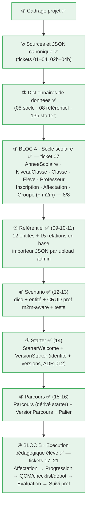

# Journal de progression : RéférenCiel Manager

> **Objet.** Ce document raconte, chapitre par chapitre, **ce qui a été fait**
> concrètement pour construire l'application : commandes lancées, entités créées,
> SQL généré, décisions prises (et pourquoi), blocages rencontrés.
> Il sert de
> **matière première** pour la future documentation du projet.
>
> **Comment le tenir.** À chaque nouvelle étape, on ajoute une sous-section datée
> avec : *contexte → commandes → résultat → décisions*. On relie aux ADR
> (`docs/adr/`) et aux retours banc d'essai (`docs/banc-essai/`) plutôt que de tout
> recopier.

---

## 1. Fondations documentaires

Avant tout code métier, le projet a posé sa **chaîne documentaire** :

- **Cadrage** : `docs/cadrage/instructions.md` (prioritaire), `cadre-projet-referenciel-manager.md`.
- **Décisions (ADR)** : `docs/adr/`, voir le [journal ADR](adr/index.md).
- **JSON canonique** : contrats + schémas + exemples (`docs/specs/json-canonique/`),
  pour deux types : `referentiel_niveau_classe` et `starter_welcome`.
- **Dictionnaires de données** : `docs/specs/data-dictionary/` (référentiel, socle
  scolaire, starter welcome).
- **Outillage qualité** : `make check` = 5 portes (pyright strict, ruff, pytest,
  `mkdocs --strict`, `forge project:check`).

La formule de référence du projet :

```text
JSON canonique          = référence structurée de construction / import
Dictionnaire de données = documentation métier enrichie
Base de données         = vérité applicative en fonctionnement
```

---

## 2. Choix du backend : MariaDB (ADR-005)

Parmi les backends Forge (hors SQLite : MariaDB, PostgreSQL alpha, MSSQL alpha),
**MariaDB** a été retenu, seul opt-in **complet**, cohérent avec la règle « 100%
Forge », et largement suffisant pour la charge d'une application pédagogique.

- Décision : [ADR-005](adr/005-backend-base-de-donnees-mariadb.md).
- Le porteur installe l'opt-in `forge-mvc-mariadb` lui-même.

---

## 3. Montée de squelette Forge « en place » (ADR-010)

Le projet suit l'évolution du framework.
Une première tentative de migration **par
déplacement de dossiers** a cassé le `.venv` (chemins absolus, non déplaçable) →
**rollback complet**. On a alors défini une méthode **en place** :

- **Décision** : [ADR-010](adr/010-montee-squelette-forge-en-place.md) + procédure
  [Montée de squelette Forge](procedures/montee-squelette-forge.md) (manifeste de
  propriété : fichiers *squelette* vs *projet*).
- **Outillage** créé :
  ```bash
  make skeleton-check REF=../Test    # écarts entre le projet et un forge new neuf
  make forge-upgrade COMMIT=<sha>    # bump du pin + réinstall forcée + make check
  ```
- **Piège documenté** : un pin git à version identique (`1.0.0rc2`) n'est **pas**
  re-fetché par pip → `pip install --force-reinstall --no-deps` (géré par la cible).
- **Structure des routes** (nouveauté ADR-068 côté Forge) : `mvc/routes/` est un
  **package** ; un fichier `mvc/routes/<x>_routes.py` par contrôleur exposant
  `register_<x>_routes(router)`, branché dans `mvc/routes/__init__.py`.

Commits de montée : passage du pin `forge-mvc` `e3197866` → **`f38d5159`** (version
intégrant les correctifs des retours).

---

## 4. Mise en place de MariaDB

### 4.1 Provisioning

`forge db:init` **affiche** le SQL de provisioning (mode par défaut) ; on l'exécute
en session admin (`sudo mariadb`) :

```sql
CREATE DATABASE IF NOT EXISTS `ReferenCiel_Manager`
  CHARACTER SET utf8mb4 COLLATE utf8mb4_unicode_ci;
-- compte admin (DDL) et compte applicatif (DML), scellés à la base
CREATE OR REPLACE USER 'app_admin'@'127.0.0.1' IDENTIFIED BY 'app_password';
GRANT ALL PRIVILEGES ON `ReferenCiel_Manager`.* TO 'app_admin'@'127.0.0.1';
CREATE OR REPLACE USER 'app_user'@'127.0.0.1' IDENTIFIED BY 'app_password';
GRANT SELECT, INSERT, UPDATE, DELETE ON `ReferenCiel_Manager`.* TO 'app_user'@'127.0.0.1';
FLUSH PRIVILEGES;
```

Config de connexion dans `env/dev` (gitignoré) : `DB_HOST=127.0.0.1`, `DB_PORT=3306`,
`DB_NAME=ReferenCiel_Manager`, `DB_ADMIN_*`, `DB_APP_*`.

Le backend est déclaré dans `optins/registry.py` : `BACKEND = "mariadb"`.

### 4.2 Table `forge_migrations`

Le registre des migrations n'était pas créé par le provisioning manuel
(→ [retour-003](banc-essai/retour-003-forge-migrations-provisioning-manuel.md),
**corrigé** dans Forge depuis). Contournement historique : création manuelle de la
table via sa DDL exacte.

### 4.3 Connexion SQLTools (piège `localhost` vs `127.0.0.1`)

`localhost` fait passer le driver par le **socket Unix** (compte `@'localhost'`),
`127.0.0.1` force le **TCP** (compte `@'127.0.0.1'`).
Nos comptes sont en
`@'127.0.0.1'` → **Server Address = `127.0.0.1`** dans SQLTools (pas `localhost`).
Mot de passe : mode « Ask on connect » ou « Driver Credentials » (le coffre chiffré),
**pas** « plaintext in settings » (car `.vscode/settings.json` est versionné).

---

## 5. Ticket 07 : Tranche verticale Bloc A (walking skeleton)

Objectif : prouver la chaîne complète **contrat → migration → base → CRUD → vue
protégée par l'auth**, sur une entité, puis élargir.

### 5.1 La chaîne d'une entité (le geste de référence)

```bash
forge make:entity <NomPascalCase>        # 1. contrat + modèle (interactif : champs)
# (si on édite le contrat : forge sync:entity <Nom>  → régénère .sql + _base.py)
forge migration:make create_<table> --from-entity <Nom>   # 2. fichier de migration
forge migration:apply                                     # 3. crée la table en base
forge make:crud <Nom>                                     # 4. contrôleur/modèle/vues/routes
# 5. brancher dans mvc/routes/__init__.py :
#    from mvc.routes.<x>_routes import register_<x>_routes
#    register_<x>_routes(router)
make check                                                # 6. 5 portes vertes
```

#### Le dérouler des questions (commandes interactives)

> **Astuce prompts** : dans `[O/n]` / `[o/N]`, la **majuscule est le défaut** ;
> une valeur entre crochets `[valeur]` est le défaut.
> Dans les deux cas, **Entrée
> accepte le défaut**.

**`forge make:entity`** : nom de table, puis une **boucle par champ**, puis les options :

```text
Nom de la table (Entrée = convention par défaut) :        → Entrée (ex. classe)
── boucle par champ ───────────────────────────────────
Nom du champ :                                            → ex. code
Type Forge [string, text, integer, big_integer, …] :     → ex. string
max_length [vide = aucun] :                               → ex. 20 (types texte)
Champ requis ? [O/n] :                                    → o / n
Autoriser NULL ? [o/N] :                                  → o / n
Champ unique ? [o/N] :                                    → o / n
Ajouter un autre champ ? [o/N] :                          → o (autre champ) / n (finir)
───────────────────────────────────────────────────────
Activer timestamps (created_at / updated_at) ? [O/n] :    → o
Activer soft_delete (deleted_at) ? [o/N] :                → n
Confirmer l'écriture des fichiers ? [O/n] :               → o
```

**`forge make:relation`** : une **relation par exécution** (relancer pour chaque FK) :

```text
Type de relation (many_to_many, many_to_one) [many_to_one] :  → Entrée
Entité source (porte la FK) :                                 → ex. Classe
Entité cible (porte la PK visée) :                            → ex. AnneeScolaire
Nom de la relation [annee_scolaire] :                         → Entrée
Nom inverse (côté cible, optionnel) :                         → ex. classes
Colonne clé étrangère [annee_scolaire_id] :                   → Entrée
FK nullable ? [O/n] :                                         → n
Politique ON DELETE (cascade, no_action, restrict, set_null) [restrict] : → Entrée
Créer un index sur la FK ? [O/n] :                            → o
Confirmer l'écriture de mvc/entities/relations.json ? [O/n] : → o
```
puis `forge sync:relations` régénère `mvc/entities/relations.sql`.

**`forge make:crud <Nom>`** : **non interactif** : génère contrôleur / modèle /
formulaire / vues + `mvc/routes/<x>_routes.py`, et **affiche** la ligne de
branchement à coller dans `mvc/routes/__init__.py` (étape 5).

> **Deux fichiers Python par entité** : `<x>_base.py` (généré, régénéré, **jamais
> édité**) et `<x>.py` (manuel, jumeau, **jamais écrasé**, ta logique métier va ici).

### 5.2 Entité `AnneeScolaire`

Première entité, déroulée de bout en bout (y compris l'auth et le login).

- **Contrat** (`mvc/entities/annee_scolaire/annee_scolaire.json`) :
  `libelle` (string, unique), `date_debut`/`date_fin` (date, nullable),
  `active` (boolean, `default: false`, ajouté à la main puis `sync:entity`),
  timestamps.
- **SQL** (extrait) :
  ```sql
  CREATE TABLE IF NOT EXISTS annee_scolaire (
      Id BIGINT UNSIGNED NOT NULL AUTO_INCREMENT,
      Libelle VARCHAR(20) NOT NULL,
      UNIQUE KEY uk_annee_scolaire_libelle (Libelle),
      DateDebut DATE NULL, DateFin DATE NULL,
      Active BOOLEAN NOT NULL DEFAULT 0,
      CreatedAt DATETIME NOT NULL, UpdatedAt DATETIME NOT NULL,
      PRIMARY KEY (Id)
  ) ENGINE=InnoDB DEFAULT CHARSET=utf8mb4;
  ```
  > Note : Forge génère les **colonnes en PascalCase** (`Libelle`, `CreatedAt`…).
- **Bugs rencontrés et corrigés** (sur l'ancien `forge-mvc`) :
  - CRUD généré cassé (helper flash manquant, modèle non typé) →
    [retour-005](banc-essai/retour-005-make-crud-code-casse-et-non-conforme.md) ;
  - à l'exécution : login KO (`is_active` int vs bool) et 500 (composant
    `button.html` manquant) →
    [retour-008](banc-essai/retour-008-bugs-runtime-login-mariadb-et-bouton-crud.md).

### 5.3 Authentification & login

```bash
forge auth:init                 # SQL du socle Auth/User dans mvc/models/sql/
# table users via migration versionnée (create_auth_socle) :
#   users, auth_tokens, auth_audit_log, auth_rate_limit_attempts
#   (user_roles/RBAC et auth_mfa_*/MFA OMIS — différés, garde-fou)
forge auth:user:create --email prof@referenciel.local --password-prompt
forge make:auth                 # contrôleur + vue login + auth_routes.py
```

- Routes : `/login` **publiques** (GET+POST), `/logout` protégée ; les routes CRUD
  sont **protégées par défaut** (le cœur redirige les non-authentifiés vers `/login`).
- **Lancer l'app** : `forge run` → serveur **HTTPS** sur `https://127.0.0.1:8000`
  (certificat auto-signé → « continuer » dans le navigateur).
- **Se connecter** : `prof@referenciel.local` / `prof1234`
  (mot de passe posé/réinitialisé via `forge auth:user:password`).
- Résultat : `https://127.0.0.1:8000/annee_scolaire` → login → **liste des années**
  (ex. `2025-2026`). ✅ Walking skeleton complet.

### 5.4 Entité `NiveauClasse`

Deuxième entité, sur le `forge-mvc` **corrigé** (`f38d5159`) : la chaîne complète
est passée **sans un seul correctif manuel** (contraste avec `AnneeScolaire`) :
preuve terrain que les correctifs Forge tiennent.

- Champs : `code` (string, unique), `intitule` (string), timestamps.

### 5.5 Entité `Classe` : relations ✅

`Classe` référence `AnneeScolaire` et `NiveauClasse` (deux `many_to_one`).
C'est
la première entité **avec relations**.

```bash
forge make:entity Classe        # champs propres : code, libelle
forge make:relation             # interactif ×2 :
#   Classe → AnneeScolaire  (FK annee_scolaire_id, on_delete restrict, index)
#   Classe → NiveauClasse   (FK niveau_classe_id,  on_delete restrict, index)
forge sync:relations            # régénère mvc/entities/relations.sql
```

**Blocage initial puis correctif Forge.** Avec `forge-mvc f38d5159`, le flux
relation ne produisait pas de schéma applicable sur MariaDB (colonne FK non
générée ; nom Pascal vs snake ; type `BIGINT` vs `BIGINT UNSIGNED`) →
[retour-009](banc-essai/retour-009-flux-relation-many-to-one-casse-mariadb.md).
**Corrigé dans `809d224f`** : `sync:relations` génère désormais
`ADD COLUMN <fk> BIGINT UNSIGNED NOT NULL` + contrainte + index, nommage cohérent.

Migration (le SQL des relations est ajouté à la migration, `migration:make` ne
l'intègre pas) :

```bash
forge migration:make create_classe --from-entity Classe   # CREATE TABLE classe
#   → on ajoute à la migration le SQL de relations.sql (ADD COLUMN + FK + index)
forge migration:apply                                     # → table classe + 2 FK
forge make:crud Classe                                    # CRUD (routes branchées)
```

Vérifié en base, la jointure tient : `classe 2TNE-A → annee 2025-2026 → niveau 2TNE`.

> **Limite connue** : le CRUD généré (depuis `classe.json`) ne gère pas les champs
> FK → le formulaire ne propose pas encore de choisir l'année/le niveau.
> Piste
> d'amélioration côté Forge (CRUD conscient des relations).

---

## 6. Catalogue des entités (propriétés)

> Récapitulatif des **champs métier** de chaque entité. Sont **implicites** (gérés
> par Forge, non listés) : `id` (`BIGINT UNSIGNED`, clé primaire auto-incrémentée)
> et, si l'option timestamps est active, `created_at` / `updated_at` (`DATETIME`).
> Rappel : les **colonnes SQL sont en PascalCase** (`Libelle`, `CreatedAt`…).

### `AnneeScolaire` : table `annee_scolaire` ✅

| Champ | Type | Contraintes | Notes |
|---|---|---|---|
| `libelle` | string(20) | **requis**, **unique** | ex. `2025-2026` |
| `date_debut` | date | nullable | début d'année |
| `date_fin` | date | nullable | fin d'année |
| `active` | boolean | **requis**, défaut `false` | règle : une seule année active |

*Options : timestamps. Table créée (migration `create_annee_scolaire`).*

### `NiveauClasse` : table `niveau_classe` ✅

| Champ | Type | Contraintes | Notes |
|---|---|---|---|
| `code` | string(20) | **requis**, **unique** | ex. `2TNE` |
| `intitule` | string(150) | **requis** | libellé du niveau |

*Options : timestamps. Table créée (migration `create_niveau_classe`). Entité
**partagée** avec le domaine référentiel.*

### `Classe` : table `classe` ✅

| Champ | Type | Contraintes | Notes |
|---|---|---|---|
| `code` | string(20) | **requis** | unique **dans l'année** (composite `(année, code)`, à venir) |
| `libelle` | string(150) | nullable | libellé lisible |
| `annee_scolaire_id` | big_integer (FK) | **requis** | → `AnneeScolaire` (many_to_one) |
| `niveau_classe_id` | big_integer (FK) | **requis** | → `NiveauClasse` (many_to_one) |

**Relations** (`mvc/entities/relations.json` → colonnes FK + contraintes appliquées) :

| Relation | Type | Clé étrangère | Politique |
|---|---|---|---|
| `Classe → AnneeScolaire` | many_to_one | `annee_scolaire_id` (`BIGINT UNSIGNED`) | `on_delete restrict`, indexée |
| `Classe → NiveauClasse` | many_to_one | `niveau_classe_id` (`BIGINT UNSIGNED`) | `on_delete restrict`, indexée |

*Options : timestamps. Table créée (migration `create_classe`, FK incluses).*

### `Eleve` : table `eleve` ✅

| Champ | Type | Contraintes | Notes |
|---|---|---|---|
| `nom` | string(100) | **requis** | |
| `prenom` | string(100) | **requis** | |
| `identifiant` | string(100) | nullable, **unique** | unique **s'il est présent** |
| `date_naissance` | date | nullable | |
| `user_id` | big_integer | nullable | **couture** vers le futur compte applicatif (auth différée), réservé, pas de relation |

*Options : timestamps. Table créée (migration `create_eleve`). Pas de relation active
(le lien `user_id → CompteUtilisateur` viendra avec un ADR dédié).*

### `Professeur` : table `professeur` ✅

| Champ | Type | Contraintes | Notes |
|---|---|---|---|
| `nom` | string(100) | **requis** | |
| `prenom` | string(100) | **requis** | |
| `user_id` | big_integer | nullable | **couture** vers le futur compte applicatif (auth différée), réservé, pas de relation |

*Options : timestamps. Table créée (migration `create_professeur`). Même schéma de
couture `user_id` que `Eleve` : le rattachement au compte viendra avec l'ADR dédié.*

### `InscriptionEleve` : table `inscription_eleve` ✅ (pivot enrichi)

Un élève inscrit dans une classe pour une année.
Premier pivot construit sur le
**nouveau modèle FK** (`32f552cc`) : chaque FK est un **champ `foreign_key`** du contrat.

| Champ | Type | Contraintes | Notes |
|---|---|---|---|
| `date_inscription` | date | nullable | date de l'inscription |
| `eleve_id` | foreign_key → `Eleve` | **requis**, FK `restrict` | |
| `classe_id` | foreign_key → `Classe` | **requis**, FK `restrict` | |
| `annee_scolaire_id` | foreign_key → `AnneeScolaire` | **requis**, FK `restrict` | |

*Contrainte **UNIQUE composite** `(eleve_id, classe_id, annee_scolaire_id)` (dictionnaire),
ajoutée à la main dans la migration. CRUD **FK-aware** (3 `<select>` peuplés). Trois
`many_to_one` déclarées via `make:relation` (relations.json = contraintes + index).*

### `AffectationProfesseurClasse` : table `affectation_professeur_classe` ✅ (pivot enrichi)

Un professeur affecté à une classe pour une année.
Même motif que `InscriptionEleve`.

| Champ | Type | Contraintes | Notes |
|---|---|---|---|
| `role` | string(100) | nullable | ex. professeur principal |
| `professeur_id` | foreign_key → `Professeur` | **requis**, FK `restrict` | |
| `classe_id` | foreign_key → `Classe` | **requis**, FK `restrict` | |
| `annee_scolaire_id` | foreign_key → `AnneeScolaire` | **requis**, FK `restrict` | |

*UNIQUE composite `(professeur_id, classe_id, annee_scolaire_id)`. CRUD FK-aware.
Noms/colonnes fidèles au dico sans collision avec `InscriptionEleve` (F24/F25 scopés).*

### `Groupe` : table `groupe` ✅ (+ pivot `groupe_eleve`)

Sous-ensemble d'une classe (TP, îlots).
Premier **many_to_many** du projet.

| Champ | Type | Contraintes | Notes |
|---|---|---|---|
| `nom` | string(100) | **requis** | ex. `Groupe 1` |
| `classe_id` | foreign_key → `Classe` | **requis**, FK `restrict` | classe parente |

*Relation **many_to_many** `eleves` ↔ `Eleve` via pivot **`groupe_eleve`** (jonction
pure : `id`, `groupe_id`, `eleve_id`, UNIQUE `(groupe_id, eleve_id)`, `ON DELETE cascade`).
DDL pivot corrigé à la main (retour-013 F28 : colonnes générées en `INT` au lieu de
`BIGINT UNSIGNED`). CRUD standard pour `nom`/`classe_id` ; l'appartenance m2m n'est pas
scaffoldée.*

> **Socle Auth/User** (`users`, `auth_tokens`, `auth_audit_log`,
> `auth_rate_limit_attempts`) : fourni par Forge (`auth:init`), non listé ici, ce
> ne sont pas des entités métier du projet.

### Domaine Référentiel (12 entités) : schéma ✅

Détail métier dans le [dictionnaire référentiel](specs/data-dictionary/dictionnaire-referentiel-niveau-classe.md).
Vue d'ensemble du modèle relationnel :

| Entité | Champs propres | Relations sortantes |
|---|---|---|
| `ReferentielNiveauClasse` | identifiant (unique), version, statut, importe_le | → `Formation`, → `NiveauClasse` · UNIQUE `(formation, niveau, version)` |
| `Formation` | code (unique), intitule | (racine) |
| `PoleActivite` | intitule | → `ReferentielNiveauClasse` |
| `ActiviteProfessionnelle` | code, intitule, conditions_exercice | → `Referentiel`, → `Pole` · **m2m** `Competence` (`activite_competence`) · UNIQUE `(ref, code)` |
| `Tache` | ordre, libelle | → `ActiviteProfessionnelle` |
| `ResultatAttendu` | code, libelle | → `ActiviteProfessionnelle` · UNIQUE `(activite, code)` |
| `Competence` | code, intitule | → `Referentiel` · UNIQUE `(ref, code)` |
| `Connaissance` | libelle, niveau_taxonomique | → `Competence` |
| `CritereObservable` | code, libelle | → `Competence` · UNIQUE `(competence, code)` |
| `IndicateurReussite` | code, libelle, origine, ref_code | → `Referentiel` · UNIQUE `(ref, code)` |
| `FamilleCompetence` | code, intitule | → `Referentiel` · **m2m** `Competence` (`cc_competence`) · UNIQUE `(ref, code)` |
| `Source` | source_id, source_type, source_fichier, source_note | → `Referentiel` (provenance) |

*FK déclarées en champs `foreign_key` du contrat (modèle `32f552cc`). `one_to_many` du dico
exprimées côté enfant (`many_to_one`). Codes « uniques dans le référentiel » = UNIQUE
composites (comme `Classe.code`). Pivots m2m corrigés à la main (F28). Pas de CRUD :
peuplé par l'importeur (ticket 11).*

### `Scenario` : table `scenario` ✅ (phase ⑥)

L'**intention pédagogique** du professeur ([dictionnaire dédié](specs/data-dictionary/dictionnaire-scenario.md)).
Premier objet métier **créé par le prof** (CRUD), pas importé.

| Champ | Type | Contraintes | Notes |
|---|---|---|---|
| `titre` | string(200) | **requis** | |
| `intention` | text | **requis** | le cœur du scénario |
| `objectifs` | text | nullable | |
| `statut` | string(20) | **requis** | cycle `brouillon`/`publie`/`archive` |
| `version` | string(20) | **requis** | |
| `referentiel_id` | foreign_key → `ReferentielNiveauClasse` | **requis** | cadre |
| `auteur_id` | foreign_key → `Professeur` | **requis** | prof auteur |

*Relations m2m : `competences` (visées, pivot `scenario_competence`) et `criteres`
(pivot `scenario_critere`). **CRUD prof m2m-aware** : selects FK + multi-select
compétences/critères + `sync_*_ids` transactionnel. Tests de persistance (mock DB).*

### `StarterWelcome` / `VersionStarter` : tables `starter_welcome` / `version_starter` ✅ (phase ⑦)

Parcours réutilisable, en **identité + versions** ([ADR-012](adr/012-versionnement-identite-plus-version.md),
[dico](specs/data-dictionary/dictionnaire-parcours.md)).

| Entité | Champs | Relations |
|---|---|---|
| `StarterWelcome` (identité) | `identifiant` (unique), `titre`, `presentation` | `niveau_classe_id` → NiveauClasse |
| `VersionStarter` (version) | `version`, `statut` (`brouillon`/`publie`/`archive`), `activite_glissante`, `ordre_impose` | `starter_id` → StarterWelcome · **unique** `(starter, version)` |

*CRUD de gestion pour les deux (select FK + checkboxes booléens). Le starter est un
**gabarit** ; ses contenus sont instanciés dans un **parcours** dérivé (voir ci-dessous). Tests (mock DB).*

### `Parcours` / `VersionParcours` / `Palier` : phase ⑧ ✅

Le parcours **organise le travail élève**, **dérivé** d'un starter ([ADR-012](adr/012-versionnement-identite-plus-version.md),
[dico Parcours](specs/data-dictionary/dictionnaire-parcours.md)).

| Entité | Champs | Relations |
|---|---|---|
| `Parcours` (identité) | `titre` | `version_starter_id` → VersionStarter (**dérivation**) |
| `VersionParcours` (version) | `version`, `statut` | `parcours_id` → Parcours · unique `(parcours, version)` |
| `Palier` (découpage) | `ordre`, `titre`, `theme`, `production_attendue`, `dossier_technique_fichier` | `version_parcours_id` → VersionParcours · unique `(version_parcours, ordre)` |

*CRUD FK-aware pour les trois. Les contenus de palier (QCM, checklist, dépôt) = Bloc B / ticket 19. Tests (mock DB).*

---

## 7. Rôle de banc d'essai : retours & tickets

L'application **exerce Forge en réel** et remonte chaque friction.
Voir la
[vue d'ensemble du banc d'essai](banc-essai/README.md).

- **Retours 001 → 014** : du squelette (001) aux bugs runtime (008), au flux
  relation (009), son intégration migration/CRUD (010), l'unicité globale noms/FK
  (011), les défauts du moteur d'entités (012), le pivot m2m en `INT` (013) et
  l'incompatibilité `forge-mvc-admin`/`entities` sur la casse des colonnes (014).
  **001-009 corrigés** et **vérifiés** ; **011 corrigé** dans `32f552cc` (unicité scopée
  par entité source, vérifié bout-en-bout) ; **010, 012, 013, 014 à remonter**.
- **Tickets consolidés** pour l'équipe Forge :
  [ticket-01](banc-essai/ticket-forge-01-retours-terrain-ciel-2tne.md) (résolu),
  [ticket-02](banc-essai/ticket-forge-02-bugs-runtime-tranche-verticale.md),
  [ticket-03](banc-essai/ticket-forge-03-flux-relation-many-to-one.md),
  [ticket-04](banc-essai/ticket-forge-04-relations-migration-et-crud.md).
- **ADR-070 (montée `32f552cc`)** : le moteur d'entités a été **extrait du cœur** dans
  l'opt-in `forge-mvc-entities`. Une montée depuis une version pré-ADR-070 le **perd en
  silence** (toutes les commandes `make:relation`/`sync:*`/`migration:*`/`db:*`
  deviennent « inconnues »). Corrigé : paquet ajouté à `requirements.txt` (épinglé) et
  `tools/forge-upgrade.sh` le réinstalle désormais avec les deux autres.
- **Nouveau modèle FK (bonus de 011)** : la FK est un **champ `foreign_key`** du contrat
  (`sync:entity` → colonne, `sync:relations` → contrainte/index), et `make:crud` est
  **FK-aware** (selects peuplés) → **retour-010 F23 réglé**.
- **Enseignement clé** : `make check` (portes statiques) peut être **vert** alors que
  l'app **plante à l'exécution** (login, rendu, relations). Seul un **parcours
  end-to-end** avec un vrai backend révèle ces bugs.

---

## 8. Décisions prises (réponses aux questions)

Trace des arbitrages structurants (le *pourquoi*) :

- **Backend** = MariaDB (ADR-005).
- **Montée de squelette** = en place, jamais par déplacement de dossier (ADR-010).
- **Auth** = socle de base uniquement ; **RBAC et MFA différés** (opt-ins non
  installés), sans désactiver l'authentification.
- **`Classe.code`** = unique **dans l'année** (composite `(année, code)`), pas
  globalement : index composite à ajouter plus tard.
- **`on_delete`** des relations = `restrict` (on ne supprime pas une année/niveau qui
  a des classes).
- **Staging git** = explicite (jamais `git add -A`) ; **commit gaté** sur
  `make check && …`.

---

## 9. État courant (au fil de l'eau)

| Élément | État |
|---|---|
| `forge-mvc` | `32f552cc` (correctifs retours 001-011) + opt-in **`forge-mvc-entities`** `32f552cc` (moteur de données, ADR-070) |
| Tables en base | `annee_scolaire`, `niveau_classe`, `classe` (+2 FK), `eleve`, `professeur`, `inscription_eleve` (+3 FK, UNIQUE), `affectation_professeur_classe` (+3 FK, UNIQUE), `groupe` (+1 FK), `groupe_eleve` (pivot m2m), `users`, `auth_*`, `forge_migrations` |
| **Bloc A : terminé ✅ (8/8)** | `AnneeScolaire`, `NiveauClasse`, `Classe`, `Eleve`, `Professeur`, `InscriptionEleve`, `AffectationProfesseurClasse`, `Groupe` |
| **⑤ Référentiel : schéma ✅ (tickets 09-10)** | 12 entités (`Formation`, `ReferentielNiveauClasse`, `PoleActivite`, `ActiviteProfessionnelle`, `Tache`, `ResultatAttendu`, `Competence`, `Connaissance`, `CritereObservable`, `IndicateurReussite`, `FamilleCompetence`, `Source`) + `NiveauClasse` réutilisée. Migration `create_referentiel` (14 tables, 13 FK, 7 UNIQUE composites, 2 pivots m2m) appliquée |
| ✅ Référentiel : ticket 11 | **Importeur complet** : service (`referentiel_importer.py`, ADR-011 upsert + best-effort), **UI d'upload admin** (validation schéma → import → rapport, provenance) + **admin de parcours** (`forge-mvc-admin`) + tests. Vérifié bout-en-bout (CIEL 2TNE : 81 objets) |
| **⑥ Scénario : terminé ✅ (tickets 12-13)** | Dictionnaire + entité `Scenario` + 2 FK + 2 m2m (compétences, critères) + **CRUD prof m2m-aware** + tests |
| **⑦ Starter : terminé ✅ (ticket 14)** | Motif **identité + versions** (ADR-012) : `StarterWelcome` + `VersionStarter` (unique `(starter, version)`) + CRUD + tests |
| **⑧ Parcours : terminé ✅ (tickets 15-16)** | `Parcours` (dérivé d'une `VersionStarter`) + `VersionParcours` (ADR-012) + `Palier` (découpage, rattaché à `VersionParcours`, unique `(version_parcours, ordre)`) + CRUD FK-aware + tests |
| **⑨ Bloc B : TERMINÉ ✅ (17-21)** | Affectation · Progression×2 · QCM+checklist+activité+dépôt (11 ent.) · Évaluation par critères (2 ent.) · **suivi prof** (`/suivi` : tableau de bord lecture seule, requêtes d'agrégation, alerte « bloqué ») |
| **Modèle + exécution : COMPLETS ✅** | **42 entités** : `référentiel → scénario → starter → parcours → affectation → progression → QCM/checklist/activité/dépôt → évaluation`, plus le **suivi**. `make check` vert (**43 tests**) |
| Auth | opérationnelle (login `admin@` et `prof@`) ; **MFA différé** |
| **Nav + RBAC : TERMINÉ ✅** | Barre à menus déroulants par domaine (`nav.html`/`nav.css`). **Rôles opérationnels** via une **couche fine maison** (`mvc/services/rbac.py`, [ADR-013](adr/013-rbac-couche-fine-maison-sur-contrat.md)) : rôles lus en base depuis la session moderne, décision au **contrat** `rbac.json`. `can()` filtre la nav, `guard_prefix` protège les routes. **admin** voit tout ; **professeur** voit Conception/Exécution/Suivi (pas Admin) ; anonyme sur route socle → **403** |
| **Espace élève : v1 ✅** | Rôle **`eleve`** (contrat + base). Lien compte↔élève : FK 1↔1 `eleve.UserId` → `users(id)` (INT, UNIQUE, `ON DELETE SET NULL`). Vue **« Mon parcours »** (`/mon-parcours`, `espace_eleve.voir`) : lecture seule, filtrée par compte (row-level), parcours affectés + paliers. Lien de nav réservé à l'élève |
| **Comptes élèves : flux admin ✅** | Écran **`/eleve/comptes`** (gardé `socle.gerer`) : l'admin crée un compte `users` (email + mot de passe hashé), lui pose le rôle `eleve` et le **lie** à une fiche `Eleve`, en une transaction. Validé bout-en-bout sur MariaDB (compte jetable). **Testable au navigateur** : créer un compte élève, se connecter, voir « Mon parcours » |
| **Espace élève v2 : saisie complète ✅** | Trois écritures élève, patron commun (garde `espace_eleve.voir` + **contrôle d'appartenance** à chaque appel, palier d'autrui → 404). **QCM** (`/mon-parcours/qcm/{id}`) : correction côté serveur (`choix.Lettre` vs `BonneReponse`), score %, tentative + réponses + statut (100 % → validé, sinon en cours, pas de régression, tentatives multiples). **Checklist** (`/checklist/{id}`) : auto-cochage `CocheEleve` (upsert idempotent), `CocheProfesseur` préservé. **Dépôt** (`/depot/{id}`) : upload via `forge-mvc-files` (allowlist), chemin en base. Checklist/dépôt : validation = professeur → statut palier inchangé. Toutes requêtes validées sur MariaDB |
| **Évaluation prof : boucle ✅** | Écran `/evaluation/progression/{id}` (gardé `execution.gerer`) : détail d'une progression élève avec **preuves** (meilleur score QCM, cochage élève/prof, nb dépôts) ; le prof **valide un palier** (`Statut` contrôlé) et **confirme la checklist** (`CocheProfesseur`, sans toucher le cochage élève). Lien « Évaluer » par élève dans le suivi |
| **Notation par critères ✅** | `/evaluation/activite/{id}` : noter l'activité d'un palier via les **critères observables** (groupés par compétence, référentiel), échelle **4 niveaux** (`non_atteint`/`partiellement_atteint`/`atteint`/`depasse`). `evaluation_activite` find-or-create + `evaluation_critere` upsert |
| **Comptes profs + évaluation nominative ✅** | FK 1↔1 `professeur.UserId` → `users(id)` (comme `eleve`). Flux admin `/professeur/comptes` (créer compte + rôle `professeur` + lier fiche). La notation est attribuée au **prof connecté** (`professeur_de_user`), repli sur le prof de l'affectation si compte non lié |
| Qualité | `make check` vert (5 portes, **67 tests**) |

> Prochaine étape : **tests terrain** (le porteur, une fois tout installé) de la boucle
> complète : plus rien ne bloque.
> La **boucle pédagogique est complète et nominative** : socle
> → référentiel → conception → affectation → saisie élève (QCM/checklist/dépôt) → évaluation
> prof (validation palier + `CocheProfesseur` + notation par critères, attribuée au prof
> connecté).
> En place : modèle (42 entités), import, nav, **RBAC** (3 rôles), **espace élève
> complet**, **comptes élèves + profs** (liés aux fiches), **évaluation prof complète**.
> Défauts Forge remontés :
> retour-010 (F22 partiel), retour-012 (F26/F27, **F27 re-rencontré 3×**), retour-013 (F28),
> retour-014 (F29), **retour-015 (F30/F31/F32, RBAC : resolveur sur session dépréciée,
> schéma non livré, deux modèles de permission)**.

---

## 10. Commandes

### 10.1 Par usage (référence)

```bash
make setup            # installe tout (prêt au dev)
make check            # 5 portes : pyright, ruff, pytest, mkdocs --strict, project:check
forge run             # lance l'app (https://127.0.0.1:8000)
forge routes:list     # liste les routes (PUBLIC / CSRF)
forge migration:status
make forge-upgrade COMMIT=<sha>   # montée du framework
make skeleton-check REF=../Test   # écarts squelette

# inspecter la base (compte admin, TCP)
mysql -h 127.0.0.1 -u app_admin -papp_password ReferenCiel_Manager -e "SHOW TABLES;"
```

### 10.2 Historique chronologique (carnet de bord)

> Séquence **réelle** des commandes qui ont construit le projet, dans l'ordre.
> Entre chaque incrément : `make check`, puis `git add <chemins> && git commit`/`push`
> (staging explicite, commit gaté).

**① Base de données (MariaDB)**

```bash
forge db:init                      # affiche le SQL de provisioning → exécuté via `sudo mariadb`
# contournement retour-003 : création manuelle de la table forge_migrations
forge doctor                       # diagnostic projet
```

**② Entité AnneeScolaire + CRUD**

```bash
forge make:entity AnneeScolaire    # champs : libelle, date_debut, date_fin, active
#   → édition du contrat : "default": false sur active
forge entity:validate
forge sync:entity AnneeScolaire    # régénère le .sql (Active … DEFAULT 0)
forge migration:make create_annee_scolaire --from-entity AnneeScolaire
forge migration:apply              # → table annee_scolaire
forge make:crud AnneeScolaire      # CRUD (+ correctifs manuels : helper flash, typage…)
#   → branchement de la route dans mvc/routes/__init__.py
```

**③ Authentification & login**

```bash
forge auth:init                    # SQL du socle Auth/User (mvc/models/sql/)
forge migration:make create_auth_socle   # rempli à la main : users, tokens, audit, rate-limit
forge migration:apply
forge auth:user:create --email prof@referenciel.local --password-prompt
forge make:auth                    # login : contrôleur + vue + auth_routes.py
#   → seed d'une année :
mysql -h 127.0.0.1 -u app_admin -papp_password ReferenCiel_Manager \
  -e "INSERT INTO annee_scolaire (Libelle, Active, CreatedAt, UpdatedAt) VALUES ('2025-2026', 1, NOW(), NOW());"
forge run                          # https://127.0.0.1:8000
forge auth:user:password --email prof@referenciel.local --password prof1234
```

**④ Montée de squelette (forge-mvc → f38d5159)**

```bash
make skeleton-check REF=../Test
make forge-upgrade COMMIT=f38d5159294ab246b1fd77a2615b4c96a3b64db1
#   → migration des routes vers le package mvc/routes/ (ADR-068)
forge make:crud AnneeScolaire      # régénère annee_scolaire_routes.py (nouvelle structure)
```

**⑤ Entité NiveauClasse**

```bash
forge make:entity NiveauClasse     # champs : code (unique), intitule
forge migration:make create_niveau_classe --from-entity NiveauClasse
forge migration:apply
forge make:crud NiveauClasse
#   → branchement de la route
```

**⑥ Montée forge-mvc → 809d224f (correctif du flux relation, retour-009)**

```bash
make skeleton-check REF=../Test
make forge-upgrade COMMIT=809d224fa4b77daffab5ac5edbe6d326ec085c67
```

**⑦ Entité Classe + relations ✅**

```bash
forge make:entity Classe           # champs : code, libelle
forge make:relation                # Classe → AnneeScolaire (FK annee_scolaire_id)
forge make:relation                # Classe → NiveauClasse  (FK niveau_classe_id)
forge sync:relations               # → relations.sql : ADD COLUMN <fk> BIGINT UNSIGNED + FK + index
forge migration:make create_classe --from-entity Classe
#   → on ajoute à la migration le SQL de relations.sql (ADD COLUMN + FK + index)
forge migration:apply              # → table classe + 2 FK
forge make:crud Classe             # CRUD (routes branchées)
#   seed de vérif : niveau 2TNE + classe 2TNE-A (année=1, niveau=1)
```

**⑧ Entité Eleve ✅** (simple, `user_id` couture différée)

```bash
forge make:entity Eleve            # nom, prenom, identifiant (unique si présent),
#                                    date_naissance, user_id (nullable, réservé)
forge migration:make create_eleve --from-entity Eleve
forge migration:apply              # → table eleve
forge make:crud Eleve              # CRUD (routes branchées)
```

**⑨ Entité Professeur ✅** (simple, `user_id` couture différée, jumelle de `Eleve`)

```bash
forge make:entity Professeur       # nom, prenom (string 100, requis),
#                                    user_id (big_integer, nullable, réservé)
forge migration:make create_professeur --from-entity Professeur
forge migration:apply              # → table professeur
forge make:crud Professeur         # CRUD (routes branchées)
```

**⑩ Montée squelette `32f552cc` (ADR-070) + restauration du moteur de données**

```bash
make skeleton-check REF=../Test                 # écarts (grossier)
make forge-upgrade COMMIT=32f552cc…             # bump 3 pins + réinstall + make check
#   ADR-070 : moteur d'entités extrait du cœur → réinstaller l'opt-in :
pip install --force-reinstall --no-deps \
  "forge-mvc-entities @ …@32f552cc#subdirectory=packages/forge-mvc-entities"
#   overlay squelette : home_controller + mvc/views/pages/charte.html
```

**⑪ Entité InscriptionEleve ✅ (pivot enrichi, nouveau modèle FK, F24/F25 corrigés)**

```bash
forge make:entity InscriptionEleve              # date_inscription (scalaire seul)
forge make:relation                             # ×3 : eleve, classe, annee_scolaire
#   → ajoute chaque FK comme champ foreign_key du contrat + relations.json
forge sync:entity InscriptionEleve              # colonnes FK dans le CREATE TABLE
forge sync:relations                            # contraintes + index
forge migration:make create_inscription_eleve --from-entity InscriptionEleve
#   compléter à la main : contraintes FK (relations.sql) + UNIQUE composite (dico)
forge migration:apply                           # → table inscription_eleve
forge make:crud InscriptionEleve                # CRUD FK-aware (3 selects)
```

**⑫ Entité AffectationProfesseurClasse ✅ (pivot enrichi, motif Inscription rodé)**

```bash
forge make:entity AffectationProfesseurClasse   # role (string nullable)
forge make:relation                             # ×3 : professeur, classe, annee_scolaire
forge sync:entity … && forge sync:relations
forge migration:make create_affectation_professeur_classe --from-entity …
#   compléter à la main : contraintes FK + UNIQUE (prof, classe, annee) — ASCII (F27)
forge migration:apply && forge make:crud AffectationProfesseurClasse
```

**⑬ Entité Groupe ✅ (many_to_one Classe + many_to_many Eleve, Bloc A complet)**

```bash
forge make:entity Groupe                        # nom (string requis)
forge make:relation                             # many_to_one → Classe
forge make:relation                             # many_to_many → Eleve (pivot groupe_eleve)
forge sync:entity Groupe && forge sync:relations
forge migration:make create_groupe --from-entity Groupe
#   corriger à la main le pivot groupe_eleve : INT → BIGINT UNSIGNED + ENGINE (F28)
forge migration:apply && forge make:crud Groupe
```

**⑭ Schéma Référentiel ✅ (phase ⑤, tickets 09-10, 12 entités d'un coup)**

```bash
forge make:entity …             # ×12 (Formation, ReferentielNiveauClasse, Pole,
#                                 Activite, Tache, Resultat, Competence, Connaissance,
#                                 Critere, Indicateur, FamilleCompetence, Source)
forge make:relation             # ×15 : 13 many_to_one + 2 many_to_many
forge sync:entity … ; forge sync:relations
forge migration:make create_referentiel   # squelette ; corps assemblé (tools scratch) :
#   12 CREATE TABLE (entités) + FK référentiel (relations.sql) + 7 UNIQUE composites
#   + 2 pivots m2m corrigés F28 (INT → BIGINT UNSIGNED + ENGINE) ; commentaires ASCII (F27)
forge migration:apply           # → 14 tables (20 entités au total)
#   pas de make:crud : le référentiel est peuplé par l'importeur (ticket 11)
```

**⑮ Importeur par upload admin ✅ (phase ⑤, ticket 11, ADR-009/010)**

```bash
pip install forge-mvc-admin forge-mvc-files    # briques (porteur)
forge opt-in:enable admin --apply ; forge opt-in:enable files --apply
#   env : UPLOAD_ALLOWED_EXTENSIONS/MIME_TYPES += json (sinon .json refusé)
#   code (pairing) : mvc/services/referentiel_importer.py (SQL paramétré, upsert,
#     mapping id locaux, best-effort) + canonical_validator.py (jsonschema 2020-12)
#     + ReferentielImportController + vues + route protégée /admin/referentiel/import
#   tests : tests/test_referentiel_importer.py (mock DB, CI-safe)
forge run                                       # upload CIEL 2TNE → rapport (81 objets)
```

**⑯ Chaîne Scenario ✅ (phase ⑥, tickets 12-13)**

```bash
#   ticket 12 : dictionnaire de données Scenario (docs/specs/data-dictionary/)
forge make:entity Scenario          # titre, intention, objectifs, statut, version
forge make:relation                 # ×4 : referentiel, auteur (m2o) + competences, criteres (m2m)
forge sync:entity Scenario ; forge sync:relations
forge migration:make create_scenario --from-entity Scenario
#   compléter : 2 FK + 2 pivots corrigés F28 ; commentaires ASCII SANS ; (F27 confirmé 2×)
forge migration:apply
forge make:crud Scenario            # CRUD prof m2m-aware (multi-select competences/criteres)
#   tests : tests/test_scenario_persistance.py (mock DB)
```

**⑰ StarterWelcome + VersionStarter ✅ (phase ⑦, ticket 14, ADR-012)**

```bash
#   ADR-012 : versionnement identité + version ; dico Starter Welcome affiné
forge make:entity StarterWelcome    # identifiant (unique), titre, presentation
forge make:entity VersionStarter    # version, statut, activite_glissante, ordre_impose
forge make:relation                 # StarterWelcome → NiveauClasse ; VersionStarter → StarterWelcome
forge sync:entity … ; forge sync:relations
forge migration:make create_starter_welcome --from-entity StarterWelcome
#   compléter : table version_starter + 2 FK + unique (starter, version) ; ASCII sans ;/'
forge migration:apply ; forge make:crud StarterWelcome ; forge make:crud VersionStarter
#   tests : tests/test_starter_versionnement.py (mock DB)
```

**⑱ Parcours + VersionParcours + Palier ✅ (phase ⑧, tickets 15-16, ADR-012)**

```bash
#   cadrage porteur : Parcours dérivé d'une VersionStarter ; Palier appartient au parcours
#   dico Parcours créé ; dico Starter révisé (Palier -> domaine Parcours)
forge make:entity Parcours ; forge make:entity VersionParcours ; forge make:entity Palier
forge make:relation   # Parcours->VersionStarter ; VersionParcours->Parcours ; Palier->VersionParcours
forge sync:entity … ; forge sync:relations
forge migration:make create_parcours --from-entity Parcours
#   compléter : 3 tables + 3 FK + 2 unique (parcours,version)/(version_parcours,ordre)
#   ATTENTION F27 : commentaires ASCII SANS ; ni ' (re-rencontré 3e fois)
forge migration:apply ; forge make:crud Parcours ; forge make:crud VersionParcours ; forge make:crud Palier
#   tests : tests/test_parcours_persistance.py (mock DB)
```

---

## 11. Vue d'ensemble : le tunnel de progression

> Le projet avance par un **tunnel** de phases (détail : [tickets](tickets/README.md)).
> Deux blocs métier à ne pas mélanger : **Bloc A** (structure scolaire, *qui est où,
> quelle année, quel niveau*) et **Bloc B** (exécution pédagogique de l'élève).
> Statut : ✅ fait · ⏸️ en pause · ⬜ à faire.



> **Où on en est** : 🏁 **tunnel complet : toutes les phases ①–⑨ faites.** Toute la
> chaîne pédagogique est **modélisée, exécutable et suivie** : `référentiel → scénario →
> starter → parcours → affectation → progression → QCM/checklist/activité/dépôt →
> évaluation par critères → suivi professeur`. **42 entités, 43 tests, `make check` vert.**
> La suite relève de l'**enrichissement** (interfaces prof/élève abouties, services
> métier, ex. valider une tentative met à jour la progression, import starter,
> permissions RBAC, seed de démonstration), pas du **squelette** métier, désormais complet.
