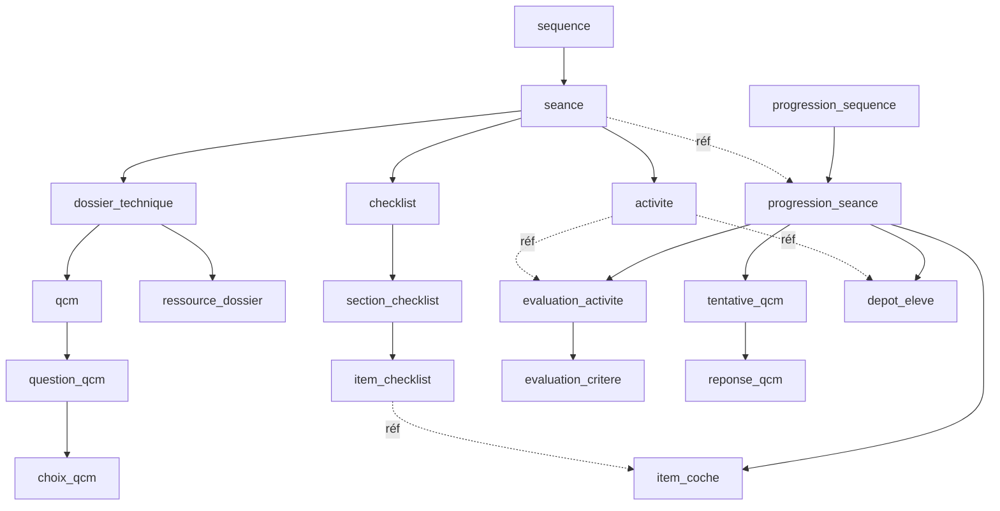

# Schéma de la base — domaine « Séance »

> Instantané du schéma **réel de la base en fonctionnement** (`ReferenCiel_Manager`), généré le 2026-07-19.
> Source de vérité applicative (ADR-003) ; extrait via `information_schema`. Vocabulaire ADR-025
> (Séance = ex-Palier, Séquence = ex-Parcours). Ce document est un instantané : régénérer après migration.

## Vue d'ensemble

**Légende des règles `ON DELETE`** : `CASCADE` = supprimé avec le parent ; `RESTRICT` = suppression du parent bloquée tant qu'il reste des enfants.

## Structure

### `sequence`

Séquence pédagogique (ex-Parcours, ADR-025). Regroupe des séances ordonnées. *Contexte : parent de la séance.*

| Colonne | Type | Null | Clé | Défaut |
|---|---|---|---|---|
| `Id` | bigint(20) unsigned | NO | PK auto_increment | — |
| `Identifiant` | varchar(100) | NO | UNIQUE | — |
| `Titre` | varchar(200) | NO |  | — |
| `Presentation` | text | YES |  | `NULL` |
| `Statut` | varchar(20) | NO |  | — |
| `ActiviteGlissante` | tinyint(1) | NO |  | — |
| `OrdreImpose` | tinyint(1) | NO |  | — |
| `niveau_classe_id` | bigint(20) unsigned | NO | FK | — |
| `CreatedAt` | datetime | NO |  | — |
| `UpdatedAt` | datetime | NO |  | — |

**Clés étrangères :**
- `niveau_classe_id` → `niveau_classe.Id` — `ON DELETE RESTRICT`

### `seance`

**Séance** (ex-Palier, ADR-025). Unité pédagogique d'une séquence. Table pivot du domaine.

| Colonne | Type | Null | Clé | Défaut |
|---|---|---|---|---|
| `Id` | bigint(20) unsigned | NO | PK auto_increment | — |
| `Ordre` | int(11) | NO |  | — |
| `Titre` | varchar(200) | NO |  | — |
| `Theme` | varchar(100) | YES |  | `NULL` |
| `ProductionAttendue` | varchar(255) | YES |  | `NULL` |
| `sequence_id` | bigint(20) unsigned | NO | FK | — |
| `CreatedAt` | datetime | NO |  | — |
| `UpdatedAt` | datetime | NO |  | — |

**Clés étrangères :**
- `sequence_id` → `sequence.Id` — `ON DELETE RESTRICT`

## Définition de la séance (côté professeur)

### `activite`

Activité à réaliser dans une séance (distincte de `activite_professionnelle`, qui appartient au référentiel).

| Colonne | Type | Null | Clé | Défaut |
|---|---|---|---|---|
| `Id` | bigint(20) unsigned | NO | PK auto_increment | — |
| `Objectif` | text | YES |  | `NULL` |
| `Fichier` | varchar(255) | YES |  | `NULL` |
| `seance_id` | bigint(20) unsigned | NO | FK | — |
| `CreatedAt` | datetime | NO |  | — |
| `UpdatedAt` | datetime | NO |  | — |

**Clés étrangères :**
- `seance_id` → `seance.Id` — `ON DELETE RESTRICT`

### `dossier_technique`

Dossier technique d'une séance : porte les ressources et le QCM. Supprimé en cascade avec la séance.

| Colonne | Type | Null | Clé | Défaut |
|---|---|---|---|---|
| `Id` | bigint(20) unsigned | NO | PK auto_increment | — |
| `Titre` | varchar(200) | NO |  | — |
| `seance_id` | bigint(20) unsigned | NO | UNIQUE | — |
| `CreatedAt` | datetime | NO |  | — |
| `UpdatedAt` | datetime | NO |  | — |

**Clés étrangères :**
- `seance_id` → `seance.Id` — `ON DELETE CASCADE`

### `ressource_dossier`

Ressource d'un dossier technique (markdown, vidéo, audio, lien).

| Colonne | Type | Null | Clé | Défaut |
|---|---|---|---|---|
| `Id` | bigint(20) unsigned | NO | PK auto_increment | — |
| `Type` | varchar(20) | NO |  | — |
| `Titre` | varchar(200) | NO |  | — |
| `Ordre` | int(11) | NO |  | — |
| `Contenu` | text | YES |  | `NULL` |
| `MediaRef` | varchar(255) | YES |  | `NULL` |
| `Url` | varchar(500) | YES |  | `NULL` |
| `dossier_technique_id` | bigint(20) unsigned | NO | FK | — |
| `CreatedAt` | datetime | NO |  | — |
| `UpdatedAt` | datetime | NO |  | — |

**Clés étrangères :**
- `dossier_technique_id` → `dossier_technique.Id` — `ON DELETE CASCADE`

### `qcm`

QCM rattaché à un dossier technique.

| Colonne | Type | Null | Clé | Défaut |
|---|---|---|---|---|
| `Id` | bigint(20) unsigned | NO | PK auto_increment | — |
| `FormatReponse` | text | YES |  | `NULL` |
| `SeuilValidation` | varchar(20) | NO |  | — |
| `dossier_technique_id` | bigint(20) unsigned | NO | UNIQUE | — |
| `CreatedAt` | datetime | NO |  | — |
| `UpdatedAt` | datetime | NO |  | — |

**Clés étrangères :**
- `dossier_technique_id` → `dossier_technique.Id` — `ON DELETE RESTRICT`

### `question_qcm`

Question d'un QCM.

| Colonne | Type | Null | Clé | Défaut |
|---|---|---|---|---|
| `Id` | bigint(20) unsigned | NO | PK auto_increment | — |
| `Numero` | int(11) | NO |  | — |
| `Enonce` | text | NO |  | — |
| `BonneReponse` | varchar(5) | NO |  | — |
| `qcm_id` | bigint(20) unsigned | NO | FK | — |
| `CreatedAt` | datetime | NO |  | — |
| `UpdatedAt` | datetime | NO |  | — |

**Clés étrangères :**
- `qcm_id` → `qcm.Id` — `ON DELETE CASCADE`

### `choix_qcm`

Choix (réponse possible) d'une question de QCM.

| Colonne | Type | Null | Clé | Défaut |
|---|---|---|---|---|
| `Id` | bigint(20) unsigned | NO | PK auto_increment | — |
| `Lettre` | varchar(5) | NO |  | — |
| `Texte` | varchar(255) | NO |  | — |
| `question_id` | bigint(20) unsigned | NO | FK | — |
| `CreatedAt` | datetime | NO |  | — |
| `UpdatedAt` | datetime | NO |  | — |

**Clés étrangères :**
- `question_id` → `question_qcm.Id` — `ON DELETE CASCADE`

### `checklist`

Checklist d'une séance.

| Colonne | Type | Null | Clé | Défaut |
|---|---|---|---|---|
| `Id` | bigint(20) unsigned | NO | PK auto_increment | — |
| `DecisionFinale` | longtext | YES |  | `NULL` |
| `seance_id` | bigint(20) unsigned | NO | FK | — |
| `CreatedAt` | datetime | NO |  | — |
| `UpdatedAt` | datetime | NO |  | — |

**Clés étrangères :**
- `seance_id` → `seance.Id` — `ON DELETE RESTRICT`

### `section_checklist`

Section d'une checklist.

| Colonne | Type | Null | Clé | Défaut |
|---|---|---|---|---|
| `Id` | bigint(20) unsigned | NO | PK auto_increment | — |
| `Numero` | int(11) | NO |  | — |
| `Titre` | varchar(200) | NO |  | — |
| `checklist_id` | bigint(20) unsigned | NO | FK | — |
| `CreatedAt` | datetime | NO |  | — |
| `UpdatedAt` | datetime | NO |  | — |

**Clés étrangères :**
- `checklist_id` → `checklist.Id` — `ON DELETE CASCADE`

### `item_checklist`

Item (point à cocher) d'une section de checklist.

| Colonne | Type | Null | Clé | Défaut |
|---|---|---|---|---|
| `Id` | bigint(20) unsigned | NO | PK auto_increment | — |
| `Libelle` | text | NO |  | — |
| `section_id` | bigint(20) unsigned | NO | FK | — |
| `CreatedAt` | datetime | NO |  | — |
| `UpdatedAt` | datetime | NO |  | — |

**Clés étrangères :**
- `section_id` → `section_checklist.Id` — `ON DELETE CASCADE`

## Progression de l'élève

### `progression_sequence`

Progression d'un élève sur une séquence (ex-ProgressionParcours). *Contexte : parent de la progression de séance.*

| Colonne | Type | Null | Clé | Défaut |
|---|---|---|---|---|
| `Id` | bigint(20) unsigned | NO | PK auto_increment | — |
| `Statut` | varchar(20) | NO |  | — |
| `DateDebut` | date | YES |  | `NULL` |
| `eleve_id` | bigint(20) unsigned | NO | FK | — |
| `sequence_id` | bigint(20) unsigned | NO | FK | — |
| `CreatedAt` | datetime | NO |  | — |
| `UpdatedAt` | datetime | NO |  | — |

**Clés étrangères :**
- `eleve_id` → `eleve.Id` — `ON DELETE RESTRICT`
- `sequence_id` → `sequence.Id` — `ON DELETE RESTRICT`

### `progression_seance`

**Progression d'un élève sur une séance** (ex-ProgressionPalier). Nœud central du suivi.

| Colonne | Type | Null | Clé | Défaut |
|---|---|---|---|---|
| `Id` | bigint(20) unsigned | NO | PK auto_increment | — |
| `Statut` | varchar(20) | NO |  | — |
| `progression_sequence_id` | bigint(20) unsigned | NO | FK | — |
| `seance_id` | bigint(20) unsigned | NO | FK | — |
| `CreatedAt` | datetime | NO |  | — |
| `UpdatedAt` | datetime | NO |  | — |

**Clés étrangères :**
- `progression_sequence_id` → `progression_sequence.Id` — `ON DELETE RESTRICT`
- `seance_id` → `seance.Id` — `ON DELETE RESTRICT`

### `item_coche`

Item de checklist coché dans une progression de séance.

| Colonne | Type | Null | Clé | Défaut |
|---|---|---|---|---|
| `Id` | bigint(20) unsigned | NO | PK auto_increment | — |
| `CocheEleve` | tinyint(1) | NO |  | — |
| `CocheProfesseur` | tinyint(1) | NO |  | — |
| `item_id` | bigint(20) unsigned | NO | FK | — |
| `progression_seance_id` | bigint(20) unsigned | NO | FK | — |
| `CreatedAt` | datetime | NO |  | — |
| `UpdatedAt` | datetime | NO |  | — |

**Clés étrangères :**
- `item_id` → `item_checklist.Id` — `ON DELETE RESTRICT`
- `progression_seance_id` → `progression_seance.Id` — `ON DELETE CASCADE`

### `evaluation_activite`

Évaluation d'une activité par un professeur, dans une progression de séance.

| Colonne | Type | Null | Clé | Défaut |
|---|---|---|---|---|
| `Id` | bigint(20) unsigned | NO | PK auto_increment | — |
| `DateEvaluation` | datetime | NO |  | — |
| `Appreciation` | text | YES |  | `NULL` |
| `progression_seance_id` | bigint(20) unsigned | NO | FK | — |
| `activite_id` | bigint(20) unsigned | NO | FK | — |
| `professeur_id` | bigint(20) unsigned | NO | FK | — |
| `CreatedAt` | datetime | NO |  | — |
| `UpdatedAt` | datetime | NO |  | — |

**Clés étrangères :**
- `activite_id` → `activite.Id` — `ON DELETE RESTRICT`
- `professeur_id` → `professeur.Id` — `ON DELETE RESTRICT`
- `progression_seance_id` → `progression_seance.Id` — `ON DELETE CASCADE`

### `evaluation_critere`

Évaluation d'un critère observable au sein d'une évaluation d'activité.

| Colonne | Type | Null | Clé | Défaut |
|---|---|---|---|---|
| `Id` | bigint(20) unsigned | NO | PK auto_increment | — |
| `Niveau` | varchar(30) | NO |  | — |
| `evaluation_activite_id` | bigint(20) unsigned | NO | FK | — |
| `critere_id` | bigint(20) unsigned | NO | FK | — |
| `CreatedAt` | datetime | NO |  | — |
| `UpdatedAt` | datetime | NO |  | — |

**Clés étrangères :**
- `critere_id` → `critere_observable.Id` — `ON DELETE RESTRICT`
- `evaluation_activite_id` → `evaluation_activite.Id` — `ON DELETE CASCADE`

### `tentative_qcm`

Tentative de QCM d'un élève, rattachée à une progression de séance.

| Colonne | Type | Null | Clé | Défaut |
|---|---|---|---|---|
| `Id` | bigint(20) unsigned | NO | PK auto_increment | — |
| `NumeroTentative` | int(11) | NO |  | — |
| `Score` | int(11) | NO |  | — |
| `Validee` | tinyint(1) | NO |  | — |
| `DateTentative` | datetime | NO |  | — |
| `progression_seance_id` | bigint(20) unsigned | NO | FK | — |
| `CreatedAt` | datetime | NO |  | — |
| `UpdatedAt` | datetime | NO |  | — |

**Clés étrangères :**
- `progression_seance_id` → `progression_seance.Id` — `ON DELETE CASCADE`

### `reponse_qcm`

Réponse à une question dans une tentative de QCM.

| Colonne | Type | Null | Clé | Défaut |
|---|---|---|---|---|
| `Id` | bigint(20) unsigned | NO | PK auto_increment | — |
| `EstCorrecte` | tinyint(1) | NO |  | — |
| `tentative_id` | bigint(20) unsigned | NO | FK | — |
| `question_id` | bigint(20) unsigned | NO | FK | — |
| `choix_id` | bigint(20) unsigned | NO | FK | — |
| `CreatedAt` | datetime | NO |  | — |
| `UpdatedAt` | datetime | NO |  | — |

**Clés étrangères :**
- `choix_id` → `choix_qcm.Id` — `ON DELETE RESTRICT`
- `question_id` → `question_qcm.Id` — `ON DELETE RESTRICT`
- `tentative_id` → `tentative_qcm.Id` — `ON DELETE CASCADE`

### `depot_eleve`

Dépôt (fichier) d'un élève pour une activité, dans une progression de séance.

| Colonne | Type | Null | Clé | Défaut |
|---|---|---|---|---|
| `Id` | bigint(20) unsigned | NO | PK auto_increment | — |
| `Fichier` | varchar(255) | NO |  | — |
| `Commentaire` | text | YES |  | `NULL` |
| `DateDepot` | datetime | NO |  | — |
| `progression_seance_id` | bigint(20) unsigned | NO | FK | — |
| `activite_id` | bigint(20) unsigned | NO | FK | — |
| `CreatedAt` | datetime | NO |  | — |
| `UpdatedAt` | datetime | NO |  | — |

**Clés étrangères :**
- `activite_id` → `activite.Id` — `ON DELETE RESTRICT`
- `progression_seance_id` → `progression_seance.Id` — `ON DELETE CASCADE`

